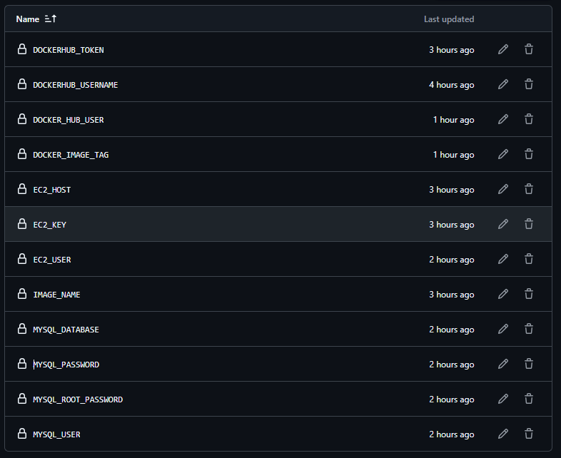

# Projeto Flask + MySQL (Docker)

Aplicação exemplo: API Flask simples que persiste usuários em MySQL. Pronto para rodar localmente com Docker Compose.

## Rápido (3 passos)
1. Crie um arquivo `.env` na raiz com as variáveis abaixo.
2. Execute: `docker compose up --build`
3. A API fica em: `http://localhost:5000`

## .env (exemplo)
```
MYSQL_DATABASE=usersdb
MYSQL_USER=app_user
MYSQL_PASSWORD=12345
MYSQL_ROOT_PASSWORD=rootpass
```

## Endpoints principais
- GET /users — lista todos os usuários
- POST /users — cria um usuário (JSON: {"name": "Nome", "email": "email@ex.com"})

## Acesso ao banco
Para abrir um shell no container MySQL:

```
docker exec -it mysql_db bash
mysql -u app_user -p
```
Senha: a definida em `MYSQL_PASSWORD` no `.env`.

## Arquivos importantes
- `app.py` — código da API
- `Dockerfile` — build da imagem da app
- `docker-compose.yml` — define serviços (app + db)
- `init.sql` — script de inicialização do banco
- `requirements.txt` — dependências Python

## Observações
- O banco usa volume persistente (`db_data`) e rede `app_network`.
- O `init.sql` cria o banco `usersdb` e o usuário `app_user`.


## CI/CD


1. [](https://github.com/vinciusLim/Trabalho_DevOps/actions/workflows/cicd.yml)

2. 
O pipeline roda automaticamente a cada push na main e executa:

Testes – instala dependências e roda os testes unitários.

Build – cria uma nova imagem Docker e envia para o Docker Hub com a tag do commit.

Deploy – conecta via SSH ao servidor, roda git pull, atualiza a imagem e reinicia o docker compose.

Esse processo garante que cada mudança na main é testada e implantada automaticamente em produção.

3.


4. 
Passos Manuais no Servidor

Realizados apenas uma vez:

Clonar o repositório no EC2.

Criar o arquivo .env com as variáveis de produção (não vai para o GitHub).

Garantir que Docker e Docker Compose estejam instalados.

Depois disso, o deploy é totalmente automático pelo GitHub Actions.
---